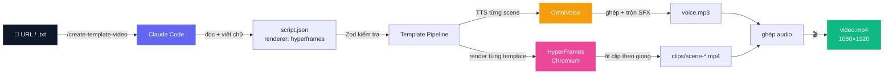

<a id="top"></a>

<div align="center">


<h1>AI&nbsp;Coding&nbsp;·&nbsp;Template&nbsp;Video</h1>

<p><b>Đưa vào một bài báo, nhận về một video 9:16.</b><br/>
Một câu lệnh, không cần dựng phim, chạy lại bao nhiêu lần cũng ra y hệt.</p>

<p>


</p>

<p><a href="README.md">English</a> · <b>🌐 Tiếng Việt</b></p>

<sub>
<a href="#-bắt-đầu-nhanh"><b>Bắt đầu nhanh</b></a> ·
<a href="#-cách-hoạt-động"><b>Cách hoạt động</b></a> ·
<a href="#-sử-dụng"><b>Sử dụng</b></a> ·
<a href="#-templates"><b>Templates</b></a>
</sub>

</div>

---

<div align="center">

</div>

> **Vì sao nó đáng tin:** AI chỉ lo phần _nội dung_ (viết kịch bản, chọn template), còn việc
> _dựng hình_ thì để code lo (từng pixel một). Nhờ vậy cùng một `script.json` thì lúc nào cũng ra
> đúng một video — không hên xui, không phải ngồi sửa tay.

Bạn chỉ cần lo phần **chữ**. Còn lại template lo hết thiết kế, bố cục, chuyển động; pipeline lo
TTS, âm thanh, render rồi ghép lại — và đưa cho bạn ba file dùng được ngay với CapCut / TikTok /
Shorts / Reels:

| File         | Dùng để làm gì                               |
| ------------ | -------------------------------------------- |
| `video.mp4`  | Video 9:16 hoàn chỉnh, đã có giọng đọc + SFX |
| `voice.mp3`  | Riêng track giọng đọc — kéo thẳng vào CapCut |
| `script.txt` | File text thô — để CapCut tự bắt phụ đề      |

---

<div align="center">

### 📚 Muốn làm chủ Claude Code? Học bài bản cùng AI Coding

<a href="https://www.udemy.com/course/claude-code-in-action-practical-guide-from-beginner-to-pro/?referralCode=C62ACDC291F191DF9E55">

</a>

**Vibe Coding Thực Chiến với Claude Code: Từ Zero đến Hero**
<br/><sub><b>Senior AI Engineer</b> @ AI Coding</sub>

<p><sub>
Setup &nbsp;·&nbsp; Permission Modes &nbsp;·&nbsp; Memory &nbsp;·&nbsp; Hooks &nbsp;·&nbsp; Skills &nbsp;·&nbsp; MCP Servers &nbsp;·&nbsp; Subagents &nbsp;·&nbsp; GitHub<br/>
Từ <b>zero</b> đến <b>hero</b> — đúng cách build agent &amp; tự động hoá như repo này.
</sub></p>

[](https://www.udemy.com/course/claude-code-in-action-practical-guide-from-beginner-to-pro/?referralCode=C62ACDC291F191DF9E55)

</div>

---

## 🚀 Bắt đầu nhanh

> 📺 **Hướng dẫn chi tiết:** [Xem video hướng dẫn trên YouTube](https://www.youtube.com/watch?v=V08-8KLmbnA)

```bash
git clone https://github.com/huytranvan2010/AI-auto-generate-video.git
cd AI-auto-generate-video
npm install
# chạy server OmniVoice ở máy bạn, rồi tạo video
```

<table>
<tr>
<td valign="top" width="50%">

**Với Claude Code** — _khuyến nghị_

```text
/create-template-video https://aicodingvn.vercel.app/some-article
```

Claude tự đọc bài, viết `script.json` rồi chạy pipeline luôn cho bạn.

</td>
<td valign="top" width="50%">

**Thủ công** — _tự viết `script.json`_

```bash
npm run pipeline -- output/my-video/script.json
```

Bạn tự kiểm soát từng scene, từng template.

</td>
</tr>
</table>

Vài phút sau → `output/<slug>/video.mp4` (1080×1920).

---

## 🎥 Live demo

### 👉 [**▶️ Watch on YouTube Shorts**](https://youtube.com/shorts/LUAgRhPBONg) 👈

[](https://youtube.com/shorts/LUAgRhPBONg)

---

## 🧠 Cách hoạt động



Pipeline chạy 8 bước, lần nào cũng như lần nấy — code ở [`src/render/template-pipeline.ts`](src/render/template-pipeline.ts):

| #   | Bước               | Kết quả                                                       |
| --- | ------------------ | ------------------------------------------------------------- |
| 1   | **Kiểm tra**       | `script.json` được validate theo schema Zod                   |
| 2   | **Văn bản phụ đề** | `script.txt` — gộp toàn bộ `voiceText` (CapCut auto-caption)  |
| 3   | **TTS / scene**    | `voice/scene-<id>.mp3` qua OmniVoice _(idempotent)_           |
| 4   | **Ghép giọng**     | `voice-raw.mp3` chèn 0.3s nghỉ + tính mốc thời gian mỗi scene |
| 5   | **Trộn SFX**       | `voice.mp3` — chèn hiệu ứng âm thanh lên giọng đọc            |
| 6   | **Render clip**    | `clips/scene-<id>-fit.mp4` — template → MP4, fit theo giọng   |
| 7   | **Ghép + mux**     | `video-silent.mp4` → `video.mp4` (ghép giọng vào)             |
| 8   | **Xong**           | in đường dẫn kết quả + tổng thời lượng                        |

---

## ⚡ Cài đặt

<details open>
<summary><b>Yêu cầu môi trường</b></summary>

<br/>

| Mục                   | Cần       | Ghi chú                                                               |
| --------------------- | --------- | --------------------------------------------------------------------- |
| **Node.js**           | ≥ 22      | `node --version`                                                      |
| **FFmpeg + ffprobe**  | bản mới   | phải có trong PATH (`ffmpeg -version`)                                |
| **Chrome / Chromium** | bất kỳ    | HyperFrames dùng để render từng template                              |
| **OmniVoice server**  | đang chạy | TTS local tại `OMNIVOICE_ENDPOINT` (mặc định `http://127.0.0.1:8123`) |
| **Claude Code CLI**   | tuỳ chọn  | chỉ cần cho skill `/create-template-video`                            |

**Cài FFmpeg:**

- **Windows** — `winget install Gyan.FFmpeg`
- **macOS** — `brew install ffmpeg`
- **Linux** — `sudo apt install ffmpeg`

</details>

<details open>
<summary><b>Cấu hình</b> — <code>.env.local</code></summary>

<br/>

Ở đây chỉ có mỗi OmniVoice, lại chạy ngay trên máy nên **chẳng cần API key gì cả.**

```env
TTS_PROVIDER=omnivoice
OMNIVOICE_ENDPOINT=http://127.0.0.1:8123
```

Server chỉ cần nhận `POST /tts` kèm `{ text }` và trả về bytes `audio/mpeg` là đủ.

</details>

---

## 🎬 Sử dụng

**Trong Claude Code** _(khuyến nghị)_ — truyền URL hoặc file `.txt`:

```text
/create-template-video https://aicodingvn.vercel.app/iphone-17-200mp
/create-template-video news/my-article.txt
```

Skill sẽ đọc nội dung, viết `script.json` rồi chạy pipeline. Cách map template và quy tắc đọc số
tiếng Việt mình đã ghi rõ trong [tài liệu skill](.claude/skills/create-template-video/SKILL.md).

**Hoặc chạy pipeline trực tiếp** với `script.json` có sẵn:

```bash
npm run pipeline -- output/<slug>/script.json
```

<details>
<summary><b>📄 Cấu trúc <code>script.json</code></b> (chế độ template)</summary>

<br/>

```json
{
    "version": "1.0",
    "renderer": "hyperframes",
    "aspect": "9:16",
    "metadata": {
        "title": "Apple ra mắt iPhone 17 camera 200MP",
        "source": {
            "url": "https://...",
            "domain": "aicodingvn.vercel.app",
            "image": null
        },
        "channel": "AI Coding"
    },
    "voice": { "provider": "omnivoice", "speed": 1.0 },
    "scenes": [
        {
            "id": "hook",
            "type": "hook",
            "voiceText": "Apple vừa ra mắt iPhone mười bảy với camera hai trăm megapixel.",
            "templateId": "frame-liquid-bg-hero",
            "inputs": {
                "kicker": "🔥 Tin nóng",
                "headline": "iPhone 17",
                "subheadline": "Camera 200MP",
                "cta": "Theo dõi ngay",
                "brand": "AI Coding"
            }
        },
        {
            "id": "body-1",
            "type": "body",
            "voiceText": "Cảm biến mới thu nhiều ánh sáng hơn, ảnh đêm sắc nét hơn rõ rệt.",
            "templateId": "frame-pentagram-stat",
            "inputs": {
                "label": "Camera",
                "headline": "200MP",
                "subtitle": "Cảm biến lớn nhất từ trước tới nay",
                "anchor": "200"
            }
        },
        {
            "id": "outro",
            "type": "outro",
            "voiceText": "Theo dõi AI Coding để xem bản tin công nghệ mới mỗi ngày.",
            "templateId": "frame-logo-outro",
            "inputs": {
                "brand_name": "AI Coding",
                "tagline": "Tin công nghệ mỗi ngày",
                "primary_url": "https://aicodingvn.vercel.app/"
            }
        }
    ]
}
```

Vài luật bắt buộc của schema: **3–12 scene**, scene đầu phải là `hook`, scene cuối phải là
`outro`, và mỗi `templateId` đều phải có thật trong `templates/`.

</details>

<details>
<summary><b>📁 Cấu trúc output</b></summary>

<br/>

```
output/<slug>-<timestamp>/
├── script.json          # đầu vào (skill sinh hoặc viết tay)
├── script.txt           # gộp voiceText — cho CapCut auto-caption
├── voice/
│   ├── scene-hook.mp3    # TTS từng scene (idempotent)
│   └── scene-*.mp3
├── voice-raw.mp3        # ghép giọng, chưa SFX (trung gian)
├── voice.mp3           # audio cuối, đã trộn SFX
├── clips/
│   ├── scene-hook.mp4     # clip template đã render (idempotent)
│   └── scene-hook-fit.mp4 # fit theo độ dài giọng của scene
├── video-silent.mp4    # ghép clip, chưa có tiếng (trung gian)
└── video.mp4          # 🎉 thành phẩm — 1080×1920 + voice + SFX
```

> **Chạy lại không sợ tốn công.** Muốn TTS lại scene nào thì xoá `voice/scene-<id>.mp3`, muốn
> render lại scene nào thì xoá `clips/scene-<id>.mp4`, rồi chạy lại pipeline — phần còn lại được
> giữ nguyên, không làm lại từ đầu.

</details>

---

## 🎨 Templates

Mỗi template là một project **HyperFrames** riêng trong `templates/` — `index.html` cho 16:9 và
`compositions/portrait.html` cho 9:16. Bạn chỉ việc điền `inputs`, phần nhìn cứ để template lo.
Danh sách slot đầy đủ xem ở [`templates/CATALOG.md`](templates/CATALOG.md).

| Template                    | Vai trò | Hợp với                                                |
| --------------------------- | :-----: | ------------------------------------------------------ |
| `frame-liquid-bg-hero`      |  hook   | Mở đầu — hero aurora với headline + nút CTA            |
| `frame-vignelli`            |  body   | Một con số ấn tượng — nền than tối + accent đỏ         |
| `frame-pentagram-stat`      |  body   | Một số/benchmark — nền tối neon + biểu đồ cột          |
| `frame-bold-poster`         |  body   | Tuyên bố mạnh nhiều dòng + figure số lớn               |
| `frame-build-minimal`       |  body   | Một từ lớn pop từng chữ — tối/cam                      |
| `frame-creative-voltage`    |  body   | Khẩu hiệu sáng tạo — split xanh điện + chữ viết tay    |
| `frame-glitch-title`        |  body   | Tin nóng / công nghệ — glitch RGB-split kiểu cyberpunk |
| `frame-aicoding-list`       |  body   | **Danh sách** 2–5 mục (icon + tag mức độ)              |
| `frame-aicoding-comparison` |  body   | **So sánh** hai thứ đối đầu                            |
| `frame-logo-outro`          |  outro  | End-card mặc định — logo glow + tên + tagline + URL    |
| `frame-statement-outro`     |  outro  | Outro thay thế — card đỏ trên nền giấy                 |

> **Thêm template của bạn:** tạo `templates/<id>/` với `index.html`, `compositions/portrait.html`,
> `hyperframes.json`, `meta.json` (+ `NOTICE.md` nếu vendored), rồi thêm một dòng vào `CATALOG.md`.
> Dùng font hỗ trợ tiếng Việt.

---

## 🔊 Hiệu ứng âm thanh (SFX)

SFX nằm trong `assets/sfx/<category>/<name>.mp3`. Với mỗi scene, bộ chọn
([`src/assets/sfx-selector.ts`](src/assets/sfx-selector.ts)) quyết định theo 3 tầng:

```
1. scene.sfx override   → file chỉ định, hoặc { "name": "none" } để tắt
2. khớp ngữ nghĩa        → từ khoá voiceText (cảnh báo→alert, kỷ lục→success, ra mắt→reveal …)
3. mặc định theo type    → hook→hook · body→callout · outro→outro
```

Trong cùng một nhóm, file được chọn bằng cách hash id của scene — nên cùng một script thì luôn ra
cùng SFX, mà các scene khác nhau vẫn nhận được file khác nhau. Thư viện SFX khá nặng nên **không
commit** vào repo:

```bash
npm run sfx:download   # tải thư viện SFX
npm run sfx:filter     # lọc / cắt bớt
```

Chưa tải `assets/sfx/` cũng chẳng sao — pipeline vẫn render ngon, chỉ là video không có tiếng động thôi.

---

## 🛠️ Công nghệ

| Lớp             | Công nghệ                                                                                 |
| --------------- | ----------------------------------------------------------------------------------------- |
| **Runtime**     | Node ≥22 · TypeScript 6 · ESM · [tsx](https://github.com/privatenumber/tsx)               |
| **Render**      | [HyperFrames](https://www.npmjs.com/package/hyperframes) `0.6.94` (HTML→MP4 qua Chromium) |
| **TTS**         | OmniVoice (local)                                                                         |
| **Schema**      | [Zod](https://zod.dev) ^4                                                                 |
| **HTTP**        | axios + [nock](https://github.com/nock/nock)                                              |
| **Concurrency** | [p-limit](https://github.com/sindresorhus/p-limit)                                        |
| **A/V**         | FFmpeg + ffprobe                                                                          |
| **Tests**       | [Vitest](https://vitest.dev) ^4                                                           |
| **Điều phối**   | skill [Claude Code](https://docs.claude.com/en/docs/claude-code/overview)                 |

---

## 🙏 Ghi nhận

- [HyperFrames](https://www.npmjs.com/package/hyperframes) — engine HTML-to-video đứng sau các template
- [OmniVoice](https://github.com/k2-fsa/OmniVoice) — text-to-speech tiếng Việt chạy local
- [html-video](https://github.com/nexu-io/html-video) — ý tưởng HTML-to-video mà dự án này học theo
- [Auto-Create-Video](https://github.com/hoquanghai/Auto-Create-Video) — dự án gốc mà bản này kế thừa và phát triển lên

---

## 💖 Ủng hộ dự án

Nếu dự án giúp bạn tiết kiệm thời gian, bạn có thể:

- ⭐ **Star repo này** — giúp nhiều người biết tới hơn
- 🎓 **[Tham khảo các khoá học của AI Coding trên Udemy](https://www.udemy.com/user/tran-van-huy-7/)**
- 📱 **Theo dõi AI Coding** trên [Facebook](https://www.facebook.com/aicoding2010) · [TikTok](https://www.tiktok.com/@aicoding2010) · [YouTube](https://www.youtube.com/@aicoding2010)
- 💬 Giới thiệu cho một người bạn đang làm nội dung
- 🐛 Báo lỗi hoặc đề xuất tính năng

---

## ⭐ Lịch sử Star

<a href="https://www.star-history.com/?type=date&repos=huytranvan2010%2FAI-auto-generate-video">
 <picture>
   <source media="(prefers-color-scheme: dark)" srcset="https://api.star-history.com/chart?repos=huytranvan2010/AI-auto-generate-video&type=date&theme=dark&legend=top-left" />
   <source media="(prefers-color-scheme: light)" srcset="https://api.star-history.com/chart?repos=huytranvan2010/AI-auto-generate-video&type=date&legend=top-left" />
   
 </picture>
</a>

---

<div align="center">

<br/>

**[⬆ Lên đầu trang](#top)**

<sub>Made with ❤️ by <b>AI Coding</b> · <a href="https://aicodingvn.vercel.app/">aicodingvn.vercel.app</a></sub>

</div>
